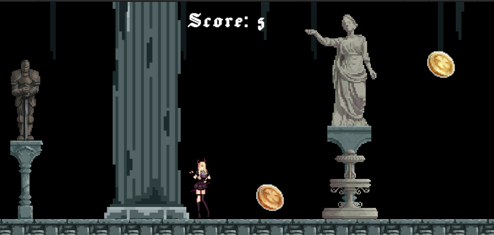

## Delivery 01 - Delivery01_GroupJ

### Description
 
$(Your Game Description)

### Features

 - Jump power-up: Higher jump
 - Player double jump
 - Coins pick-up by player

### Controls

Keyboard:
 - Keyboard: WASD and Arrow Keys for player movement
 - Keyboard: SPACE for player jump
 - Keyboard: ENTER to start/restart game
 - Keyboard: ESCAPE to exit game and close program

### Screenshots

_TODO: Show your game to the world, animated GIFs recommended!._

### Developers

 - Joel Pacheco - (Programer / Project Manager)
 - Arnau Seguí - (Game Desing / Audio Director / Programer)
 - Erik Rodriguez - (Programer / Menu Desinger)
 - Aimar Gomez - (Programer / UI Director)
 - Aarman Singh - (Art Director)

### Links

 - YouTube Gameplay: $(YouTube Link)
 - itch.io Release: $(itch.io Game Page)
 - Steam Release: $(Steam Game Page)

### License

This game sources are licensed under MIT license. Check [LICENSE](LICENSE) for further details.

$(Additional Licenses)

*Copyright (c) 2025 Joel Pacheco, Arnau Seguí, Erik Rodriguez, Aimar Gomez, Aarman Singh*
